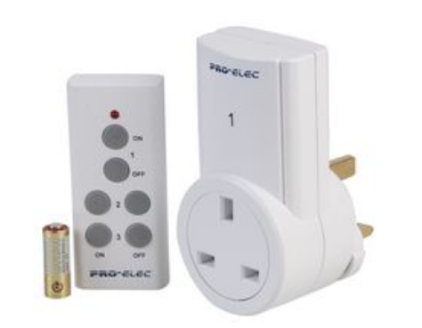
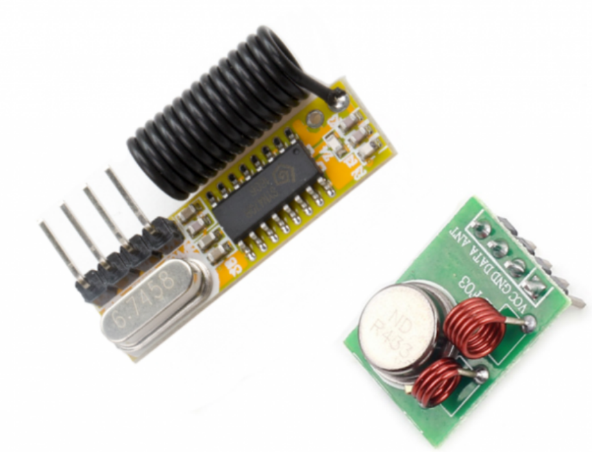
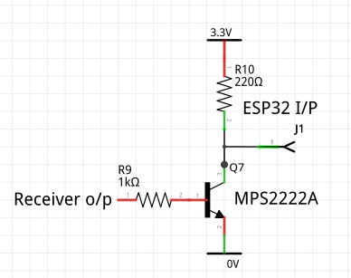
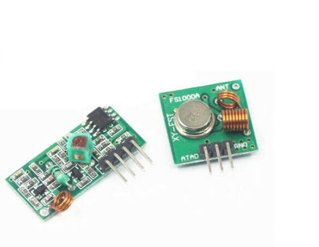

# A library for 433MHz remote control

Remote controlled wall sockets provide a convenient way to control power to
electrical equipment.



They are cheap, reliable and consume negligible power. However they lack
flexibility: they can only be controlled by the matching remote. This library
provides a means of incorporating them into an IOT (internet of things)
solution, or building a remote capable of controlling more devices with a
better antenna and longer range than the stock item.

For the constructor a key benefit is that no high voltage wiring is required.

The approach relies on the fact that most units use a common frequency of
433.92MHz. Transmitter and receiver modules are available for this frequency at
low cost, e.g. [from Seeed](https://www.seeedstudio.com/433Mhz-RF-link-kit-p-127.html).
The Seeed units:



I also tried one from eBay. This worked, but the receiver had poor sensitivity
requiring the remote to be held very close to it to achieve results.

#### Receiver

The signal from the supplied remote is captured by a simple utility and stored
in a file. Multiple signals - optionally from multiple remotes - may be stored
in a file. The utility is used interactively at the REPL. Supported targets are
Pyboard D, Pyboard 1.x, Pyboard Lite, ESP32 and Raspberry Pi Pico.

#### Transmitter

This module is intended to be used by applications. The application loads the
file created by the receiver and transmits captured codes on demand.
Transmission is nonblocking. Supported targets are Pyboard D, Pyboard 1.x,
ESP32 and Raspberry Pi Pico. Pyboard Lite works in my testing, but only in
blocking mode. The module does not use `uasyncio` but is compatible with it.

#### Warning

It should be noted that this is for experimenters. The capture process cannot
be guaranteed to work for all possible remotes and all radio receivers, not
least because the timing requirements are quite stringent. The receivers I own
introduce significant jitter. The library uses averaging over multiple frames
to improve accuracy.

See [section 6](./README.md#6-background) for the reasons for this approach.

#### Raspberry Pi Pico note

Early firmware has [this issue](https://github.com/micropython/micropython/issues/6866)
affecting USB communication with some PC's. This has been fixed: please use
firmware V1.16 or later.

#### ESP32 note

A breaking change was introduced to the firmware in July 2021 affecting the
transmitter. The code has been adapted to accommodate this: in consequence
firmware more recent than this must now be used (a daily build, until the
release of V1.17).

# 1. Installation

## 1.1 Code

Receiver: copy the `rx` directory and contents to the target's filesystem.  
Transmitter: copy the `tx` directory and contents to the target's filesystem.

In each directory there is a file `get_pin.py`. This provides a convenient way
to instantiate a `Pin` on Pyboard, ESP32 or Raspberry Pi Pico. This may be
modified for your own needs or ignored and replaced with your own code.

There are no dependencies.

## 1.2 Hardware

It is difficult to generalise as there are multiple sources for 433MHz
transceivers. Check the data for your modules.

My transmitter and receiver need a 5V supply. The receiver produces a 0-5V
signal: this is compatible with Pyboards but the ESP32 and Raspberry Pi Pico
require a circuit to ensure 0-3.3V levels. The receiver code is polarity
agnostic so an inverting buffer as shown below will suffice.

Receiver defaults are pin X3 on Pyboard, pin 27 on ESP32 and pin 17 on Pico,
but any pins may be used.



The transmitter can be directly connected as 5V devices are normally compatible
with 3.3V logic levels. Transmitter defaults are X3 on Pyboard, 23 on ESP32 and
16 on the Pico. Any pins may be substituted. The 
[data for the Seeed transmitter](https://www.seeedstudio.com/433Mhz-RF-link-kit-p-127.html)
states that a supply of up to 12V may be used to increase power. Whether this
applies to other versions is moot: try at your own risk. I haven't. All the
remotes I've seen use a miniature 12V battery. This may (or may not) mean that
a 12V supply is commonplace on transmitter modules.

## 1.3 Hardware usage

Pyboards: Timer 5.  
ESP32: RMT channel 0.  
Pico: PIO state machine 0, IRQ 0, PIO 0.  

The Pico uses `tx/rp2_rmt.py` which uses the PIO for nonblocking modulation in
a similar way to the ESP32 RMT device. To use this library there is no need to
study the code, but documentation is available
[here](https://github.com/peterhinch/micropython_ir/blob/master/RP2_RMT.md) for
those interested.

# 2. Acquiring data

The `RX` class behaves similarly to a dictionary, with individual captures
indexed by arbitrary strings. An `RX` instance is created with
```python
from rx import RX
from rx.get_pin import pin
recv = RX(pin())
```
To capture a pin on a remote and associate it with the key "on", the remote
should be placed close to the receiver and the button held down. Then issue
```python
recv('on')
```
If the capture is successful, [diagnostic](./README.md#22-diagnostics)
information will be output. If capture fails with an error message, repeat the
process with the same key string. It is important that the button is pressed
before issuing the above line, and only released when the REPL reappears.

To capture further buttons, repeat the procedure with a unique key for each
button.

When this is complete, the dictionary can be saved as a JSON file (in this
example called "remotes") with:
```python
recv.save('remotes')
```

## 2.1 RX class

Examples assume an `RX` instance `recv`; `key` is a string used as a dictionary
key.

Constructor args:  
 1. `pin` A `Pin` instance initialised as input.
 2. `nedges=800` The number of transitions acquired in a capture. Larger values
 may provide better accuracy at the cost of RAM use.

Methods:
 1. `load(fname)` Load an existing JSON file.
 2. `save(fname)` Save the current set of captures to a JSON file.
 3. `__call__(key)` Start a capture using the passed (string) key: `recv('TV on')`.
 4. `__delitem__(key)` Delete a key: `del recv['TV on']`.
 5. `__getitem__(key)` Return a list of pulse durations (in μs): `lst = recv['TV on']`.
 6. `show(key)` As above but in more human readable form.
 7. `keys()` List the keys.

## 2.2 Diagnostics

These are intended to provide some feedback on the likely success of a capture.
The acid test is, of course, to transmit it. A successful capture will produce
output similar to this:
```
Frame length = 50 No. of frames = 14
Averaging 14 frames
Capture quality  34.3 (perfect = 0)
```
This shows that each frame comprises 50 edges (25 "mark" pulses). The capture
process acquired 14 complete frames. In this instance all frames were of the
same length so none were discarded. Averaging was done on all of them to yield
accurate timing information.

On occasion the diagnostics will report discarding frames of the wrong length:
if only one or two are discarded the capture will probably be successful.

The "Capture quality" is a measure of the standard deviation of the timing of
the frames; a perfect capture would produce a value of zero. Its purpose is to
help with placement of the remote near to the receiver. There is no particular
"fail" threshold: I have had successful captures with values >60. A value
around 15 is good.

# 3. Transmitting

Assuming the JSON file "remotes" is on the target's filesystem, and it contains
a button capture with the key "TV on":
```python
from tx import TX
from tx.get_pin import pin
transmit = TX(pin(), 'remotes')
transmit('TV on')  # Immediate return
```
The transmit method is nonblocking, on Pyboard, ESP32 and Raspberry Pi Pico.
There is an alternative blocking method for use on Pyboard only. This offers
more precise timing, and I found it necessary on the Pyboard Lite only. This is
accessed as:
```python
transmit.send('TV on')  # Blocks
```
The capture process stores data with a resolution of +-1μs (absolute accuracy
is less, as discussed above). The ESP32 uses the RMT class and the Pico uses a
PIO library: both these solutions produce pulses whose lengths match the data
value +-1μs. To put this in context, the shortest pulse I have measured from a
remote is 110μs.

## 3.1 The TX class

Examples assume a `TX` instance `tx`; `key` is a string used as a dictionary
key.

Constructor args:  
 1. `pin` A `Pin` instance initialised as output, with `value=0`.
 2. `fname` Filename containing the captures.
 3. `reps=5` On transmit, the captured pulse train is repeated `reps` times.

Methods:  
 1. `__call__(key)` Normal nonblocking transmit: `tx('TV on')`. Blocks for
 ~2.2ms on Pyboard 1.1, 980μs on ESP32. Transmission continues as a background
 process.
 2. `send(key)` Blocking transmit. For more precise timing on Pyboard only.
 3. `__getitem__(key)` Return a list of pulse durations: `lst = tx['TV on']`.
 Values are μs.
 4. `show(key)` As above but in more human readable form.
 5. `keys()` List the keys.
 6. `latency()` Returns a time in ms calculated from the capture file. It is
 the recommended minimum length of time which should elapse between successive
 nonblocking transmissions. The value is conservative. Switching wall sockets
 is subject to unknown amounts of latency in the sockets and in the powered
 devices themselves: it is not capable of millisecond-level precision.

Class method:  
 1. `active_low()` Match a transmitter which transmits on a logic 0 (if such
 things exist). Pyboard only. Call before transmitting data. In this case the
 `Pin` passed to the constructor should be initialised with `value=1`.

On ESP32 and Raspberry Pi Pico if an active low signal is required an external
inverter must be used.

The value of the `reps` constructor arg may need to be increased for some types
of socket or in cases where radio interference is present. If your captures are
not received, try a value of 10. Larger values increase RAM use (on ESP32, not
on Raspberry Pi Pico). They improve the probability of successful reception.
The
[rc-switch](https://github.com/sui77/rc-switch) library uses a value of 10.

## 3.2 Example uasyncio usage

This assumes that the new `uasyncio` will acquire a `Queue` class. Other tasks
place keys onto the queue, `send_queued()` transmits them ensuring that the
latency limit is met.

```python
import uasyncio as asyncio
from tx import TX
from tx.get_pin import pin
txq = asyncio.Queue()  # Other tasks put data onto queue.
async def send_queued():
    transmit = TX(pin(), 'remotes')
    delay = transmit.latency()  # Only need to calculate this once
    while True:
        to_send = await txq.get()
        transmit(to_send)
        await asyncio.sleep_ms(delay)
```
In the continued absence of an official `Queue` class, an unofficial version is
available, documented
[here](https://github.com/peterhinch/micropython-async/blob/master/v3/docs/TUTORIAL.md#35-queue).

# 4. File maintenance

The `RX` class enables maintenance of the JSON file: it is possible to add new
captures and overwrite or delete existing ones.

### Adding new captures

Load an existing file, add a new capture, and update the file. The same
procedure might be used to replace a capture which had failed to work:
```python
from rx import RX
from rx.get_pin import pin
recv = RX(pin())
recv.load('remotes')  # Load file, start remote transmitting, then issue:
recv('TV on')  # With remote continuously transmitting
recv.save('remotes')  # Save file to same name
```

### Deleting a capture

```python
from rx import RX
from rx.get_pin import pin
recv = RX(pin())
recv.load('remotes')  # Load file
del recv['TV on']
recv.save('remotes')  # Save file to same name
```

### Printing timing information

Data is stored as a series of pulse lengths in μs. These may be printed out.
```python
from rx import RX
from rx.get_pin import pin
recv = RX(pin())
recv.load('remotes')  # Load file
recv.show('TV on')  # Access capture
```
The default state of the transmitter is not transmitting, so the first entry
(#0) represents carrier on (mark). Consequently even numbered entries are marks
and odd numbers are spaces. Captured frames have an even number of entries.
This ensures that the carrier is off between sequences. Leaving it on is an
invalid use of the 433MHz band. If creating sequences in code, this should be
honoured.

# 5. It doesn't work. What should I do?

If the capture process reports success, the problem is likely to be with the
transmitter.

Try running the receiver, connected to a scop or logic analyser while operating
the transmitter to see if pulses are being received. Alternatively run the
receiver utility on another MicroPython device. Try first with the remote and
then using the transmitter. If they are detected you can be confident of the
transmitter hardware.

On any target increase the `reps` constructor arg to 10 and possibly beyond.

On the Pyboard try the blocking `send` method. I found this necessary on the
Pyboard Lite: it offers better timing. ESP32 and Raspberry Pi Pico timing are
highly accurate for reasons discussed [above](./README.md#3-transmitting).

# 6. Background

My house is littered with remote controlled mains sockets. These are usually
located in hard to reach places, behind computers or other kit, and are
controlled by tiny 433MHz remote controls. They have two limitations:
 1. Range. This can be down to two metres. With decent antennas 433MHz band
 devices can communicate over 100M or more. The problem results from small
 antennas and difficult receiver locations.
 2. Flexibility. Sockets can only be controlled by the bundled remote.

For some time I've been considering ways to control mains devices with greater
range, ideally from the internet, but all had drawbacks. These 433MHz sockets
have the benefits of being utterly reliable with power consumption too low for
me to measure (<0.5W). A means of transmitting to them from a MicroPython
target would present a wide range of control options.

This was inspired by 
[a forum post](https://forum.micropython.org/viewtopic.php?f=14&t=7854#p45239)
by Kevin Köck. Having posted [my IR library](https://github.com/peterhinch/micropython_ir)
it struck me that there was a lot of commonality. In each case we generate and
receive OOK (on-off keying) messages. In the case of 433MHz the conversion
between modulation and carrier is done by external hardware. A cheap 433MHz
transmitter, driven by a Pyboard D or ESP32, might provide a solution with
network connectivity.

Depending on range, these could be deployed in two ways:  
 1. A single, centrally located, TX with a good antenna and groundplane might
 serve all sockets in a house.
 2. Failing that, several transmitters could be located near their respective
 sockets.

## 6.1 Implementation

There seems to be one measure of standardisation between these devices: the RF
carrier frequency of 433.92MHz. There are two potential ways of approaching the
problem, both of which work with IR transceivers.

## 6.2 Solution 1: Implement specific protocols

This has been done in [rc-switch](https://github.com/sui77/rc-switch), a C
library for Arduino and the Raspberry Pi. It supports 12 protocols: it seems
evident that there is much less standardisation than in the IR arena where a
few well-documented protocols find wide use. In many IR applications the
programmer can choose the protocol and buy a remote which supports it. This
luxury isn't available to someone with a pre-existing set of switched sockets.

Advantages:
 1. Efficient applications can be written: each remote key can be represented
 by a single integer or string, being the data to transmit.
 2. There is no need for data capture and hence no need for a receiver.
 3. Transmit timing based on protocol knowledge is as accurate as possible.

Drawbacks:
 1. Some protocols use weird concepts such as tri-bits. The set of N-bit binary
 numbers representing transmit data contains invalid bit patterns.
 2. It's hard to do because of the multitude of protocols. The Arduino library
 is quite big.
 3. Porting is problematic: an example of all 12 types of socket would be
 required and I believe many are for US 115V power.

[This reference](http://tinkerman.eldiariblau.net/decoding-433mhz-rf-data-from-wireless-switches/)
describes some of the issues.

## 6.3 Solution 2: capture and play back

This involves setting up a receiver, pressing a key on the remote, and storing
the received pulse train for subsequent playback, typically on a different
device.

With IR protocols this is problematic. Protocols have radically different ways
to deal with the case where a key is held down. Radio protocols repeatedly send
the same code, greatly simplifying capture.

Advantages:
 1. It is protocol-agnostic so should work on any set of sockets.
 2. The code is simple and easily tested.

Drawbacks:
 1. It requires a receiver to perform the initial capture.
 2. It needs a fairly fast and capable target because timing is critical.
 3. It is relatively inefficient: every key will be represented by a list of N
 integers, being the on or off duration in μs. In practice N is typically 50;
 data volume is hardly excessive.
 4. There is some loss of timing precision as the capture process introduces
 uncertainty.

Note that once the capture task is complete the receiver and target can be
re-purposed. Receivers are cheap and are usually bundled with transmitters.

## 6.4 Test results

The modulation is quite fast with pulse durations down to values on the order
of 100μs. Successful capture depends on the quality of the receiver. The
[Seeed](https://www.seeedstudio.com/433Mhz-RF-link-kit-p-127.html) one had much
better sensitivity than this one, bought on eBay:



With this receiver, even with the remote very close to the receiver, there was
jitter in the output pulse train. This was sufficient to prevent successful
transmission. Attaching an antenna made no discernible difference.

Because of these problems the code captures a few frames and performs
averaging. The eBay one worked, but I recommend the Seeed one which produced
better diagnostic information without having to place the remote centimetres
from the receiver.

# 7. File format

In response to requests I have provided `example_file` as an instance of the
file format in use. It is a JSON encoded `dict`. The key is a string defining
the button name. The example has keys "on" and "off". The value is a list of
times in μs. The first is a transmitter ON time, followed by an OFF time,
continuing to the end of the list.

